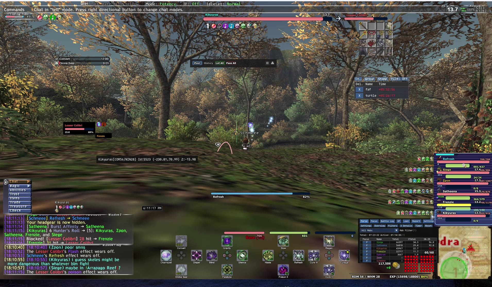
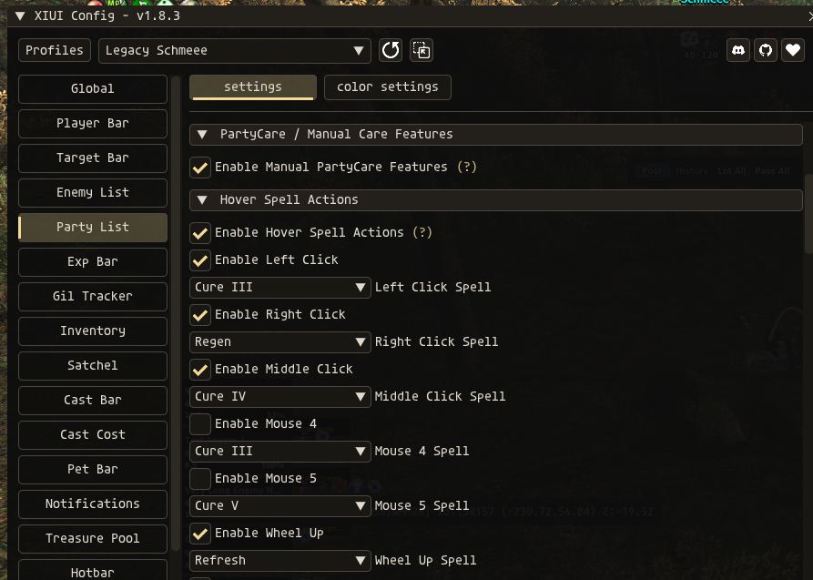

# XIUI 1.8.3 — Manual PartyCare Integration

This is a **separate XIUI 1.8.3 integration build**. It keeps XIUI’s native party-list appearance and adds optional PartyCare-style manual care controls directly to each party entry. It does **not** replace or modify the standalone PartyCare addon package, which remains your fallback.

> **Safety contract:** Nothing in this build casts automatically or changes your selected target. A spell is queued only after you explicitly click the dedicated remedy button or use a configured mouse button/wheel action while hovering an in-zone XIUI party entry.

## Demonstration

> **Watch the 32-second in-game demonstration:** Click the preview above, or use this direct [MP4 demonstration link](https://github.com/5chm33/xiui-partycare/raw/refs/heads/main/docs/media/xiui-partycare-demo.mp4). The clip shows the native XIUI Party List PartyCare configuration and the manual-care controls in action.

| Capability | Default | Native XIUI behavior |
|---|---:|---|
| Manual PartyCare feature layer | Off | Adds no extra window or standalone PartyCare skin. |
| Hover spell actions | Off | Left, right, middle, Mouse 4, Mouse 5, Wheel Up, and Wheel Down are independently configurable. Wheel Up defaults to **Refresh**; Wheel Down defaults to **Haste**. |
| Remedy recommendations | On after feature layer is enabled | Shows only the highest-priority remedy that is eligible for your own current character. |
| Clickable remedy action | On after feature layer is enabled | Shows a clear red `Remedy: <spell>` button inline with the affected XIUI party member’s name. |
| Purple Refresh cue | Off | Purple pulse in the configured final lead time; solid purple when missing. The cue is restored after a completed observed Refresh later expires. |
| Yellow Haste cue | Off | Yellow pulse in the configured final lead time; solid yellow when missing. |

## Installation

Back up your existing `addons/XIUI` folder before testing. Extract the `XIUI` folder from this archive into your Ashita `addons` directory, replacing the existing XIUI folder only after your backup has been made. Reload XIUI or restart the client after replacing files.

For a clean test, unload or disable the standalone PartyCare addon first. This prevents duplicate remedy controls, wheel bindings, and color alerts. The standalone PartyCare files are **not** included as replacements in this package and can be restored or re-enabled at any time.

## Enable and Configure

Open `/xiui`, navigate to **Party List**, and expand **PartyCare / Manual Care Features**. Enable the master toggle, then independently enable whichever capabilities you want.

### Settings Preview

> **Native configuration in XIUI:** The PartyCare controls live directly inside the Party List settings panel, including separate spell selectors for Left Click, Right Click, Middle Click, Mouse 4, Mouse 5, and the mouse wheel.

| `/xiui` section | Controls |
|---|---|
| **Hover Spell Actions** | Enables any desired combination of Left Click, Right Click, Middle Click, Mouse 4, Mouse 5, Wheel Up, and Wheel Down. Each has its own spell selector. Click bindings default off so XIUI Click to Target keeps working until you deliberately enable one. |
| **Remedy Suggestions and Manual Button** | Shows the highest-priority applicable remedy and, optionally, its clear red inline `Remedy: <spell>` button on the affected entry. It appears only for a verified debuff with an eligible remedy. |
| **Refresh and Haste Name Cues** | Enables purple Refresh and yellow Haste name cues, maximum-MP threshold for Refresh, observed durations, and early-warning lead times. |
| **Remedy Priority Rules** | Enables/disables individual direct-effect remedy rules and adjusts their priority. |

## Remedy Eligibility and Reliability

Remedy eligibility is evaluated using **only your local player character’s current effective main job, subjob, and Level Sync-adjusted levels**. Party members’ job levels are never used to decide whether you can cast a spell. A confirmed unlearned spell or definite level lock is hidden. During short spellbook-loading transitions, level-eligible standard spells remain available as manual candidates rather than being falsely suppressed.

The integration maps only direct, well-defined status icons to remedies. It intentionally excludes generic `stat_down` / Evasion Down-style icon groups because those can be ambiguous or transient around Level Sync and cannot safely be translated to one universal Erase recommendation.

Visual priority is fixed to preserve clarity: **red actionable remedy alert**, then **purple Refresh**, then **yellow Haste**. XIUI now retains the local Refresh/Haste action separately from the cast-bar display. Once a local cast is observed, its name cue remains clear during the active interval, then **pulses throughout the configured final lead time even while the positive status icon is still visible**. At the expected end, a still-visible icon remains authoritative; once that icon disappears, the cue returns as solid missing purple or yellow. This timer is visual-only and does not cast, retarget, or retry spells.

## XIUI Macrofix Message

The XIUI log in the provided screenshot is **not generated by this PartyCare integration**. XIUI detected that the standalone `macrofix` addon had loaded before XIUI and altered the same memory patterns. For a clean XIUI setup, unload `macrofix`, restart the game, and load XIUI first; XIUI reports that it already includes Macrofix-style functionality. The controller-patch notice is a separate version-pattern detection message and does not affect the PartyCare features.

## Intentional Scope

This first XIUI-native build focuses on the requested party-list features: manual hover spells, manual remedies, and Refresh/Haste cues. It deliberately does **not** include the prior experimental enemy Dispel panel, because Ashita’s enemy-buff visibility was not reliable enough to present it as a dependable party-care feature.

## Validation

The included deterministic regression test is `tests/test_partycare_integration.lua`. It covers standard spell eligibility, confirmed/unready spellbook handling, direct status mapping, remedy priority, command construction, all mouse-button/wheel dispatches, upkeep priority, cast-bar-independent Refresh observation, interruption handling, and post-expiration re-alerting. All XIUI Lua files and this regression test passed local validation at package time.

## Rollback

To roll back, restore the `addons/XIUI` backup you made before installation and reload XIUI. You may then re-enable the untouched standalone PartyCare addon if desired.
