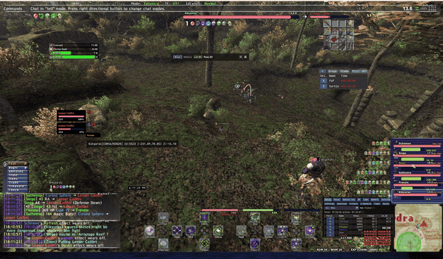

# XIUI 1.8.3 — Manual PartyCare Integration

This is a **separate XIUI 1.8.3 integration build**. It keeps XIUI’s native party-list appearance and adds optional PartyCare-style manual care controls directly to each party entry. It does **not** replace or modify the standalone PartyCare addon package, which remains your fallback.

> **Safety contract:** Nothing in this build casts automatically or changes your selected target. A spell is queued only after you explicitly click the dedicated remedy button or use a configured mouse button/wheel action while hovering an in-zone XIUI party entry.

## Demonstration

> **Inline in-game demonstration:** This 15-second GIF loops directly on the front page and shows the fusion in action during combat. The original full 32-second capture remains available as an optional [high-quality MP4 download](https://github.com/5chm33/xiui-partycare/raw/refs/heads/main/docs/media/xiui-partycare-demo.mp4).

| Capability | Default | Native XIUI behavior |
|---|---:|---|
| Manual PartyCare feature layer | Off | Adds no extra window or standalone PartyCare skin. |
| Hover spell actions | Off | Left, right, middle, Mouse 4, Mouse 5, Wheel Up, and Wheel Down are independently configurable. Wheel Up defaults to **Refresh**; Wheel Down defaults to **Haste**. |
| Remedy recommendations | On after feature layer is enabled | Shows only the highest-priority remedy that is eligible for your own current character. |
| Clickable remedy action | On after feature layer is enabled | Shows a clear full-width red `REMEDY: <spell>` action strip directly beneath the affected XIUI party card. |
| Current-target Dispel action | On after Enemy List actions are enabled | Shows a blue `DISPEL` action strip on the currently selected XIUI Enemy List card. It is a manual cast control, not an automatic enemy-buff detector. |
| Confirmed positive-effect cue | On after Enemy List actions are enabled | Pulses a card red after XIUI confirms the enemy gained a known positive effect on itself. It is visual-only and intentionally does not promise every effect is dispellable. |
| Purple Refresh cue | Off | Purple pulse in the configured final lead time; solid purple when missing. The cue is restored after a completed observed Refresh later expires. |
| Yellow Haste cue | Off | Yellow pulse in the configured final lead time; solid yellow when missing. |
| Dilation Ring timing adjustment | Auto on | Detects an equipped HorizonXI Dilation Ring at local cast start or completion and adds its documented 30-second duration bonus to that observed cue timer. A separate manual fallback is available if the client does not expose the equipped ring. |
| Enemy List offensive hover actions | Off | A fully separate manual offensive layer for XIUI Enemy List cards. Wheel Up defaults to **Dia** and Wheel Down to **Paralyze**; Dia, Blind, Paralyze, Slow, Bind, Gravity, Sleep, Silence, Dispel, elemental enfeebles, and more are selectable. |

## Installation

Back up your existing `addons/XIUI` folder before testing. Extract the `XIUI` folder from this archive into your Ashita `addons` directory, replacing the existing XIUI folder only after your backup has been made. Reload XIUI or restart the client after replacing files.

For a clean test, unload or disable the standalone PartyCare addon first. This prevents duplicate remedy controls, wheel bindings, and color alerts. The standalone PartyCare files are **not** included as replacements in this package and can be restored or re-enabled at any time.

## Enable and Configure

Open `/xiui`, navigate to **Party List**, and expand **PartyCare / Manual Care Features**. Enable the master toggle, then independently enable whichever capabilities you want.

### Settings Preview

> **Native configuration in XIUI:** The PartyCare controls live directly inside the Party List settings panel, including separate spell selectors for Left Click, Right Click, Middle Click, Mouse 4, Mouse 5, and the mouse wheel.

| `/xiui` section | Controls |
|---|---|
| **Hover Spell Actions** | Enables any desired combination of Left Click, Right Click, Middle Click, Mouse 4, Mouse 5, Wheel Up, and Wheel Down. Each has its own spell selector. Click bindings default off so XIUI Click to Target keeps working until you deliberately enable one. |
| **Remedy Suggestions and Manual Button** | Shows the highest-priority applicable remedy and, optionally, a high-visibility full-width red `REMEDY: <spell>` strip directly beneath the affected party card. It appears only for a verified debuff with an eligible remedy. |
| **Refresh and Haste Name Cues** | Enables purple Refresh and yellow Haste name cues, maximum-MP threshold for Refresh, base durations, early-warning lead times, automatic Dilation Ring timing adjustment, and a manual Dilation fallback for clients that do not expose equipped gear. |
| **Remedy Priority Rules** | Enables/disables individual direct-effect remedy rules and adjusts their priority. |
| **Enemy List → Manual Offensive Hover Spells** | Independent left/right/middle/Mouse 4/Mouse 5/wheel bindings for offensive and enfeebling spells, plus an optional blue `DISPEL` action strip for the already selected card. No action changes targets. |

## Party List position persistence

Party List windows now save their individual positions when you release a drag. This applies independently to **Party List**, **Party List 2**, and **Party List 3**, so each position survives party-composition changes, zoning, XIUI reloads, and the next game session. XIUI writes one profile update after the drag completes rather than continuously while you are moving a list.

## Separate Enemy-List Offensive Actions

Open `/xiui`, select **Enemy List**, and expand **Manual Offensive Hover Spells**. This section is completely separate from the Party List support bindings, so the same mouse/wheel control can safely mean a cure, buff, or remedy over a party member and an offensive spell over the enemy currently selected in the Enemy List.

The Enemy List layer is opt-in. Its default spell choices are **Wheel Up = Dia** and **Wheel Down = Paralyze**, while all physical click bindings default disabled to preserve XIUI’s normal Click to Target behavior. Enable only the inputs you want, then choose from the dedicated offensive/enfeebling spell list.

When Enemy List actions are enabled, **Show Current-Target Dispel Button** provides a visible blue `DISPEL` strip only when the card is already selected as `<t>` **and** XIUI has an active packet-confirmed positive-effect cue for that exact enemy. The input remains in XIUI’s native Enemy List window, while a final foreground visual pass paints the strip above themed card and child-window layers so it remains readable as well as clickable. If no confirmed cue is active, no Dispel row is shown. The action remains a single explicit manual click—there is no target change, automatic cast, or inferred buff detection.

**Blink Red for Confirmed Enemy Positive Effects** adds the requested visual cue. It now pulses a light red **card background** after a completed enemy self-action carries a known positive status icon, including HorizonXI result-message variants and additional-effect result fields. It still ignores cast starts, other-target actions, and explicit negative status icons. The cue clears when a matching effect-removal packet arrives or when **any party member’s** completed action reports that a status disappeared from the cued enemy—even if HorizonXI supplies no usable status icon, spell ID, or the expected magic-completion category. This target-specific, party-origin fallback clears the affected enemy card only and remains limited to explicit status-removal messages. The bounded maximum hold time remains as the final fallback when no removal packet is available. It is intentionally a manual Dispel prompt rather than an automatic action or a guarantee that every confirmed positive effect can be dispelled.

> **Current-target safeguard:** Hovering or clicking a different Enemy List card first preserves XIUI Click to Target and does not cast. An enemy-care command—including the blue `DISPEL` button—is constructed only for the already selected card and uses `/ma "Spell" <t>`—there is no automatic retargeting, background retry, or autonomous spell selection. The flashing red cue is visual-only.

## Remedy Eligibility and Reliability

Remedy eligibility is evaluated using **only your local player character’s current effective main job, subjob, and Level Sync-adjusted levels**. Party members’ job levels are never used to decide whether you can cast a spell. A confirmed unlearned spell or definite level lock is hidden. During short spellbook-loading transitions, level-eligible standard spells remain available as manual candidates rather than being falsely suppressed.

The integration maps only direct, well-defined status icons to remedies. When a verified status has an eligible local remedy, it renders a **full-width red `REMEDY: <spell>` strip beneath that party card**. The action is drawn directly inside XIUI’s own Party List input window with a dedicated reserved row, then painted through a final foreground visual pass so themed card backgrounds cannot hide the label. This preserves the stable native hit area while making the control clearly visible and preventing overlap with the next party member. Generic `stat_down` / Evasion Down-style icon groups remain intentionally excluded because they can be ambiguous or transient around Level Sync and cannot safely be translated to one universal Erase recommendation.

Visual priority is fixed to preserve clarity: **red actionable remedy alert**, then **purple Refresh**, then **yellow Haste**. XIUI now retains the local Refresh/Haste action separately from the cast-bar display. Once a local cast is observed, its name cue remains clear during the active interval, then **pulses throughout the configured final lead time even while the positive status icon is still visible**. The duration sliders remain the standard base values. By default, PartyCare checks for an equipped Dilation Ring at both local cast start and completion, then adds HorizonXI’s documented 30-second ally-duration bonus to that particular cue timer.[^1] The `/xiui → Party List → Refresh and Haste Name Cues` automatic checkbox can disable that adjustment for an unusual setup. If a custom client or gear processor prevents Ashita from exposing the equipped ring, enable **Always apply Dilation Ring +30s to local casts** only while the ring is equipped for the cast; it applies the bonus without relying on inventory detection. At the expected end, a still-visible icon remains authoritative; once that icon disappears, the cue returns as solid missing purple or yellow. This timer is visual-only and does not cast, retarget, or retry spells.

Party status icons establish whether a buff is active but do not expose its remaining seconds. Therefore, an early pulse can be precise for a locally observed cast (including the Dilation Ring check at its start), while a Refresh or Haste applied by another player or before XIUI loads is still handled conservatively: no invented countdown is shown until the status icon disappears.

## Enemy List Cleanup

Enemy List cards are retained when a mob attacks a party member or is claimed by the party. XIUI now also listens for authoritative claim updates: when a tracked linked mob becomes yellow/unclaimed or is claimed by someone outside the party, its card is removed immediately, along with any retained Dispel cue. This prevents non-aggressive linked mobs from remaining on the list after a wipe or deaggro without relying on distance guesses or requiring a relog.

## XIUI Macrofix Message

The XIUI log in the provided screenshot is **not generated by this PartyCare integration**. XIUI detected that the standalone `macrofix` addon had loaded before XIUI and altered the same memory patterns. For a clean XIUI setup, unload `macrofix`, restart the game, and load XIUI first; XIUI reports that it already includes Macrofix-style functionality. The controller-patch notice is a separate version-pattern detection message and does not affect the PartyCare features.

## Intentional Scope

This XIUI-native build focuses on manual native-card controls: party-list support spells, manual remedies, Refresh/Haste cues, and the separate Enemy List offensive spell bindings. It deliberately does **not** include the prior experimental **automatic enemy-Dispel recommendation** panel, because Ashita’s enemy-buff visibility is not reliable enough to present it as a dependable automated suggestion. You may still assign **Dispel** to an explicit Enemy List mouse binding when it is appropriate.

## Validation

Run the complete deterministic syntax-and-regression suite from any working directory with `./tests/run.sh`. Set `LUA_BIN` to select an interpreter, for example `LUA_BIN=luajit ./tests/run.sh` or `LUA_BIN=lua5.4 ./tests/run.sh`. The runner prints the interpreter version, syntax-checks every tracked Lua source and test with that interpreter, and then runs each `tests/test_*.lua` file from the repository root. CI performs a full-tree Lua 5.4 check and tests the repaired Lua 5.1-compatible HP module plus all deterministic tests on a pinned MoonJIT 2.1 family build; see `.github/workflows/lua-tests.yml`. The vendored Satchel module uses Lua 5.2 `goto` labels and therefore cannot be parsed by MoonJIT/Lua 5.1; use `LUA_SYNTAX_SCOPE=moonjit` when intentionally running the compatible MoonJIT subset.

The included deterministic regression tests cover standard spell eligibility, confirmed/unready spellbook handling, direct status mapping, remedy priority, support mouse-button/wheel dispatches, upkeep priority, cast-bar-independent Refresh observation, interruption handling, post-expiration re-alerting, the separate Enemy List current-target/no-retarget safeguards, manual current-target Dispel dispatch with final foreground visual rendering and active-cue visibility gating, conservative packet-confirmed enemy positive-effect cue creation/clearing including party-origin iconless cross-category removal results, Enemy List deaggro retirement after authoritative claim changes, drag-release Party List profile persistence without per-frame disk writes, HP color thresholds, and a native-remedy-row layout contract. These tests use mocks and source contracts; they do not validate Ashita/ImGui frame behavior or live-client/server behavior. See [UPSTREAM_DELTA.md](UPSTREAM_DELTA.md) for the documented baseline and local-delta boundary.

## Rollback

To roll back, restore the `addons/XIUI` backup you made before installation and reload XIUI. You may then re-enable the untouched standalone PartyCare addon if desired.

[^1]: [HorizonXI Wiki, “Dilation Ring”](https://horizonffxi.wiki/Dilation_Ring), which lists `Allies: "Refresh" and "Haste" Duration +30s`.
